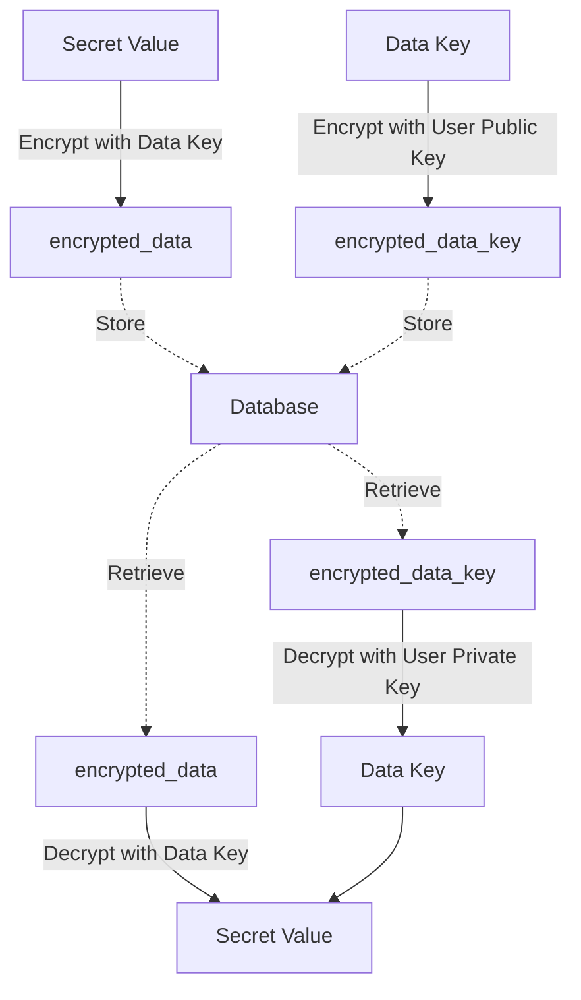

# Sealbox

A Simple Secret Storage Service – self-hosted and developer-friendly.

Sealbox is a lightweight, single-node secret storage service designed for developers and small teams. It supports envelope encryption, embedded storage via SQLite, and a simple REST API to manage secrets securely in local or edge environments.

---

## Why Sealbox?

Most secret management solutions like HashiCorp Vault, AWS Secrets Manager, or GCP Secret Manager are powerful—but also complex, over-engineered, and deeply cloud-integrated. They often assume enterprise-scale deployments, dynamic secret provisioning, complex ACLs, and heavy agent-based integrations.

Sealbox is different.

Sealbox is built for developers and small teams who value:
- **Simplicity**: No servers to cluster (unless you want to), no plugins to configure, no cloud dependencies.
- **Security by default**: AES-GCM envelope encryption, zero plaintext storage, JWT-based auth, namespace isolation.
- **Single-binary, opinionated design**: Embedded SQLite, stateless API, and minimal configuration—all in one self-contained binary.
- **Predictability**: Instead of flexible-but-complex policies, Sealbox favors convention: one secret = one key, no magic.
- **Designed for CI, containers, and local-first environments**: Works equally well in Docker, bare-metal, or Kubernetes.

Sealbox doesn’t aim to replace Vault. It aims to be the 90% simpler alternative when you don’t need dynamic database credentials or secret leasing—but still want safe, verifiable secret storage.

## When Not to Use Sealbox?
- You need dynamic database credentials (use HashiCorp Vault).
- You require fine-grained multi-tenant ACLs (future roadmap).
- Your secrets must sync across regions (consider cloud-native solutions).

---

## Features

### MVP 0.1.0
- Envelope encryption
- Static token auth
- SQLite storage
- PUT/GET/DELETE HTTP API
- TTL field support (no GC)
- REST API only (no CLI)

### v1.0.0
- Sealbox CLI
- JWT authentication (with replay protection)
- Secret versioning
- Automatic TTL expiration cleanup
- Raft replication for multi-replica SQLite
- Docker Compose support
- Helm Chart support (Kubernetes)

### v1.1.0
- Web UI
- Access audit logging
- CLI secret decryption cache
- Metadata query API

### Future
- External KMS support (AWS, Vault)
- TPM/YubiKey hardware key support
- Multi-tenant ACL
- Pluggable crypto backend
- CLI auto-login via OAuth2 Device Code Flow
- Additional authentication strategies

---

## Getting Started

```bash
# Build Sealbox (Rust required)
cargo build --release

# Run Sealbox
STORE_PATH=/var/lib/sealbox.db \
MASTER_KEY_PATH=/var/lib/sealbox.key \
AUTH_TOKEN=secrettoken123 \
LISTEN_ADDR=127.0.0.1:8080 \
./target/release/sealbox
```

On first startup, Sealbox will:
- Generate a random 256-bit master key (if not found at `MASTER_KEY_PATH`)
- Save the base64-encoded master key to the configured file
- Print a one-time recovery mnemonic for backup and recovery

The server will then enter active state and be ready to serve requests.

---

## REST API

| Method | Path               | Description                     |
|--------|--------------------|---------------------------------|
| PUT    | /v1/secrets/:key   | Encrypt and store secret        |
| GET    | /v1/secrets/:key   | Decrypt and return secret       |
| DELETE | /v1/secrets/:key   | Delete a stored secret          |

Query parameters:
- `namespace`: logical group for secrets (if applicable)
- `key`: the name of the secret

Headers:
- `Authorization: Bearer <JWT>`

Note: The `version` field is automatically incremented on each `PUT`, but not exposed via the API in v1.0. Historical versions are stored internally for future use (e.g., audit, rollback) but not exposed to clients.

---

## Authentication

Sealbox supports two authentication mechanisms:

### 1. Kubernetes Auth (Cloud-native)
- For services deployed in Kubernetes, Sealbox authenticates via Pod ServiceAccount tokens
- The client (CLI or SDK) reads the token from the Pod’s filesystem and authenticates via `POST /api/auth/k8s`
- The server verifies the token against the Kubernetes cluster CA and issues a signed JWT

### 2. Device Login (Local / Server / CI)
- For developer machines, Docker Compose, CI pipelines, or bare-metal Linux
- Run `sealbox login --device`
- Sealbox will show a one-time verification code and URL
- Open the URL in a browser, authenticate, and enter the code
- Once verified, the CLI receives a signed JWT and stores it locally

This covers both interactive and automated environments in a secure and unified way.

#### Auth Token Format

Sealbox issues JWT tokens signed using RSA256. The public key is exposed at:
```
GET /api/auth/public.pem
```

Claims may include:
- `sub`: subject (user or service identity)
- `exp`: expiry timestamp (e.g. 24h)
- `aud`: audience validation (e.g. `sealbox`)
- `scope`: permissions (reserved for future use)
- `jti`: unique token ID (for replay protection)

#### JWT Replay Protection (v1.0)

To prevent replay attacks, Sealbox will implement nonce-based token tracking:
- Each JWT will include a `jti` (JWT ID) claim that uniquely identifies the token
- The server will maintain an in-memory or persistent store of recently seen `jti` values
- Each authenticated request will check whether the `jti` has been used before
- Expired or reused `jti` values will be rejected

---

## Storage Design

Sealbox uses end-to-end encryption (E2EE) by default: secrets are always encrypted with a user-held private key model. The server never has access to the keys required to decrypt user data.

---

### End-to-End Encryption (E2EE, User-Held Private Key)

**How it works:**
- Each user generates a key pair (public/private).
- For each secret, a random Data Key is generated.
- The secret value is encrypted with the Data Key (`encrypted_data`).
- The Data Key is encrypted with the user’s public key (`encrypted_data_key`).
- Only the user, holding the private key, can decrypt the Data Key and thus the secret.
- The server only stores encrypted data and public keys.

**Schema:**
```sql
CREATE TABLE IF NOT EXISTS master_keys (
    id TEXT PRIMARY KEY,
    public_key TEXT NOT NULL,
    created_at INTEGER NOT NULL,
    status TEXT NOT NULL,
    description TEXT,
    version INTEGER,
    metadata TEXT
);

CREATE TABLE IF NOT EXISTS secrets (
    namespace TEXT NOT NULL,
    key TEXT NOT NULL,
    version INTEGER NOT NULL DEFAULT 1,
    encrypted_data BLOB NOT NULL,
    encrypted_data_key BLOB NOT NULL,
    master_key_id TEXT NOT NULL, -- references master_keys.id
    created_at INTEGER NOT NULL,
    updated_at INTEGER NOT NULL,
    expires_at INTEGER,
    metadata TEXT,
    PRIMARY KEY (namespace, key, version)
);
```

**Features:**
- Versioning (by incrementing `version` per insert)
- TTL (`expires_at`)
- Auditing (`created_at`, `updated_at`, `metadata`)
- Multi-user and multi-tenant isolation

**E2EE Flow:**


**Advantages:**
- Sealbox server cannot decrypt user secrets; only the user with the private key can.
- No root key or server-side master key required.
- Supports multi-user and multi-tenant isolation by design.

**Considerations:**
- Sealbox only returns encrypted secrets; decryption is always performed client-side.
- Lost private keys mean lost data.
- Key rotation requires support for multiple public keys and batch re-encryption.

---

### Master Key Rotation in E2EE Mode

Sealbox supports master key (public key) rotation to ensure cryptographic agility and security. The rotation process allows users to update their encryption key pair without losing access to existing secrets.

**Rotation Workflow:**
1. User generates a new key pair (public/private).
2. The new public key is registered in the `master_keys` table and marked as active.
3. New secrets are encrypted with the new public key.
4. For existing secrets:
    - The user retrieves the encrypted data and encrypted data key.
    - The user uses their old private key to decrypt the data key, then re-encrypts the data key with the new public key.
    - The updated `encrypted_data_key` is uploaded to Sealbox, referencing the new `master_key_id`.
5. Once all secrets have been re-encrypted, the old public key can be marked as retired or removed.

**Rotation Flow:**
```mermaid
flowchart TD
    subgraph Before Rotation
      D1[encrypted_data_key (Old Public Key)] -->|Decrypt with Old Private Key| DK[Data Key]
    end
    subgraph After Rotation
      DK -->|Encrypt with New Public Key| D2[encrypted_data_key (New Public Key)]
    end
```

**Key Points:**
- Multiple public keys can coexist during rotation; each secret references its corresponding `master_key_id`.
- Old public keys should not be deleted until all secrets have been re-encrypted.
- Users are responsible for securely managing both old and new private keys during the transition.


### Note on Raft and SQLite

In v1.0, Sealbox will support multi-replica deployments using Raft. Since SQLite does not support concurrent writes, Sealbox will apply the Raft consensus log and WAL replay pattern: only the leader will accept writes, replicate them via Raft log, and followers will apply the same changes deterministically to their local SQLite copies.

---

## Configuration

Sealbox is configured via environment variables:

```env
STORE_PATH=/var/lib/sealbox.db
MASTER_KEY_PATH=/var/lib/sealbox.key
LISTEN_ADDR=127.0.0.1:8080
AUTH_TOKEN=secrettoken123
```

---

## Example (curl)

```bash
curl -X PUT http://localhost:8080/v1/secrets/db-password \
     -H "Authorization: Bearer secrettoken123" \
     -d 'supersecret'

curl -X GET http://localhost:8080/v1/secrets/db-password \
     -H "Authorization: Bearer secrettoken123"

curl -X DELETE http://localhost:8080/v1/secrets/db-password \
     -H "Authorization: Bearer secrettoken123"
```

---

## License

Apache License 2.0
